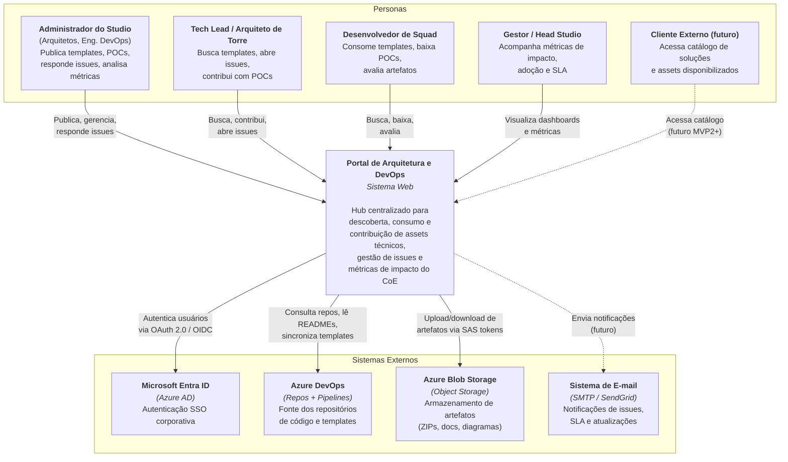
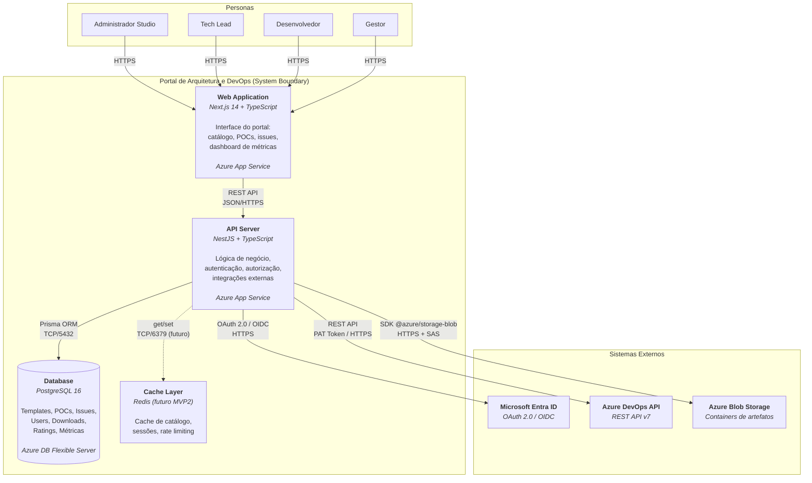
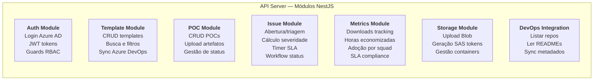
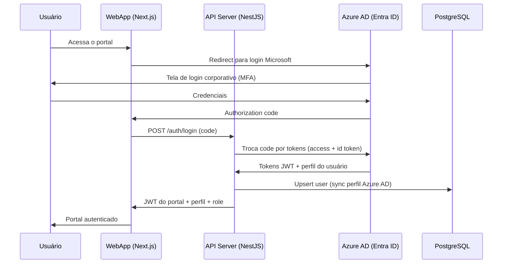
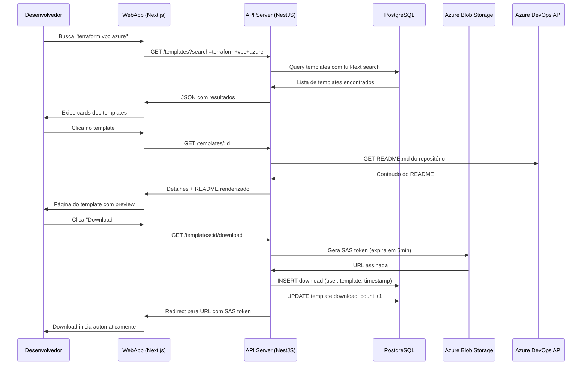
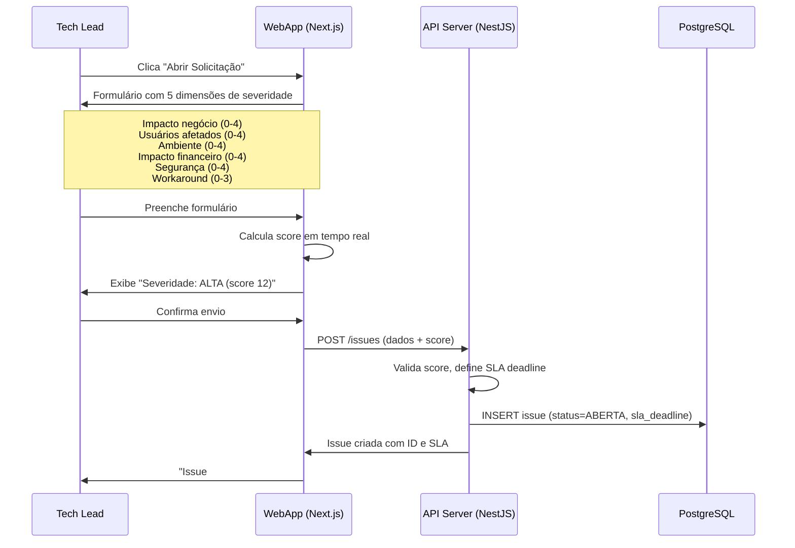

# Portal de Arquitetura e DevOps — C4 Model (N1 e N2)

**Data:** 22/05/2026
**Autor:** Studio de Arquitetura e DevOps — Foursys
**Status:** Rascunho para discussão
**Versão:** 0.1

---

## C4 Model — Nível 1: Diagrama de Contexto

> **Objetivo:** Mostrar o sistema como uma "caixa preta" e seus relacionamentos com pessoas e sistemas externos. Responde à pergunta: *quem usa o sistema e com o que ele se comunica?*

### Legenda do Diagrama de Contexto

| Elemento | Tipo | Descrição |
|---|---|---|
| **Administrador do Studio** | Persona | Arquitetos e Eng. DevOps do Studio que publicam e gerenciam conteúdo |
| **Tech Lead / Arquiteto de Torre** | Persona | Consumidores avançados que também contribuem com assets |
| **Desenvolvedor de Squad** | Persona | Consumidor principal — busca e baixa templates/POCs |
| **Gestor / Head Studio** | Persona | Visualiza métricas de impacto e adoção |
| **Cliente Externo** | Persona (futuro) | Acesso externo quando o portal virar produto |
| **Portal de Arquitetura e DevOps** | Sistema (nosso) | O sistema sendo construído |
| **Microsoft Entra ID** | Sistema externo | Autenticação corporativa SSO |
| **Azure DevOps** | Sistema externo | Repositórios de código fonte existentes |
| **Azure Blob Storage** | Sistema externo | Armazenamento de artefatos para download |
| **Sistema de E-mail** | Sistema externo (futuro) | Notificações assíncronas |

### Fluxos Principais (N1)

| # | Fluxo | Descrição |
|---|---|---|
| F1 | Publicação | Admin cria/edita template ou POC no portal, que armazena metadados no banco e artefatos no Blob Storage |
| F2 | Descoberta | Dev busca no catálogo, filtra por tags/categoria, visualiza README inline (via Azure DevOps API) |
| F3 | Consumo | Dev baixa template/POC (download via SAS token do Blob Storage), contador incrementa |
| F4 | Solicitação | Tech Lead abre issue para o CoE, sistema calcula severidade e inicia timer de SLA |
| F5 | Métricas | Gestor acessa dashboard com horas economizadas, adoção por squad, SLA compliance |

---

## C4 Model — Nível 2: Diagrama de Container

> **Objetivo:** Abrir a "caixa preta" do Nível 1 e mostrar os containers (aplicações, bases de dados, serviços) que compõem o sistema. Responde à pergunta: *quais são as peças técnicas e como se comunicam?*

### Detalhamento dos Containers

---

#### Container 1: Web Application (Frontend)

| Atributo | Valor |
|---|---|
| **Tecnologia** | Next.js 14+, React 18, TypeScript |
| **Hospedagem** | Azure App Service (B1) |
| **Responsabilidade** | Interface do usuário, SSR, navegação, formulários |

**Módulos da interface:**

| Módulo | Funcionalidade |
|---|---|
| **Catálogo de Templates** | Listagem com grid/cards, busca full-text, filtros por categoria/tag/cloud, preview de README, botão de download |
| **Repositório de POCs** | Listagem de POCs com status, detalhes com problema/solução/lições, download de artefatos, rating |
| **Painel de Issues** | Formulário de abertura, calculadora de severidade, kanban de status, timer SLA visível, comentários |
| **Dashboard de Métricas** | Gráficos de downloads, horas economizadas, adoção por squad, SLA compliance, ranking de contribuidores |
| **Administração** | CRUD de templates/POCs (admin), gestão de categorias/tags, gestão de usuários e perfis |

---

#### Container 2: API Server (Backend)

| Atributo | Valor |
|---|---|
| **Tecnologia** | NestJS, Node.js 20 LTS, TypeScript |
| **Hospedagem** | Azure App Service (B1) |
| **Responsabilidade** | Lógica de negócio, autenticação, autorização, integrações |

**Módulos do backend:**

| Módulo | Endpoints principais | Integrações |
|---|---|---|
| **AuthModule** | `POST /auth/login`, `GET /auth/me`, `POST /auth/refresh` | Azure AD (OIDC) |
| **TemplateModule** | `GET /templates`, `POST /templates`, `GET /templates/:id`, `GET /templates/:id/download` | Azure DevOps API, Blob Storage |
| **POCModule** | `GET /pocs`, `POST /pocs`, `PATCH /pocs/:id`, `GET /pocs/:id/download` | Blob Storage |
| **IssueModule** | `GET /issues`, `POST /issues`, `PATCH /issues/:id/status`, `POST /issues/:id/comments` | PostgreSQL |
| **MetricsModule** | `GET /metrics/downloads`, `GET /metrics/hours-saved`, `GET /metrics/adoption`, `GET /metrics/sla` | PostgreSQL |
| **StorageModule** | (interno) Upload, geração SAS, limpeza | Blob Storage |
| **DevOpsModule** | (interno) Sync repos, leitura README | Azure DevOps API |

---

#### Container 3: Database

| Atributo | Valor |
|---|---|
| **Tecnologia** | PostgreSQL 16 |
| **Hospedagem** | Azure Database for PostgreSQL — Flexible Server (B1ms) |
| **ORM** | Prisma |
| **Responsabilidade** | Persistência de todos os dados do sistema |

**Tabelas principais:**

| Schema/Tabela | Propósito | Relações |
|---|---|---|
| `users` | Perfis sincronizados do Azure AD | Referenciado por todas as tabelas |
| `templates` | Metadados dos templates (título, categoria, tags, repo_url) | `author -> users` |
| `pocs` | Metadados das POCs (problema, solução, status, tecnologias) | `author -> users` |
| `issues` | Solicitações ao CoE (severidade, SLA, status, workflow) | `requester -> users`, `assignee -> users` |
| `issue_comments` | Histórico de comentários nas issues | `issue -> issues`, `author -> users` |
| `downloads` | Registro de cada download (quem, o quê, quando) | `user -> users`, `template/poc` |
| `ratings` | Avaliações dos usuários sobre templates/POCs | `user -> users`, `template/poc` |
| `categories` | Categorias dos templates (Terraform, K8s, CI/CD...) | Referenciado por `templates` |
| `tags` | Tags livres para classificação flexível | Many-to-many com `templates`, `pocs` |
| `audit_log` | Log de ações para auditoria e compliance | `user -> users` |

---

#### Container 4: Cache Layer (futuro MVP2)

| Atributo | Valor |
|---|---|
| **Tecnologia** | Redis |
| **Hospedagem** | Azure Cache for Redis (Basic C0) |
| **Responsabilidade** | Cache de listagens, sessões, rate limiting |
| **Quando** | MVP2 — quando a base de usuários crescer para 50+ |

---

### Fluxos Detalhados (N2)

#### Fluxo 1: Autenticação SSO

#### Fluxo 2: Download de Template

#### Fluxo 3: Abertura de Issue com Cálculo de Severidade

---

## Decisões Arquiteturais no C4

| ADR | Decisão | Justificativa no contexto C4 |
|---|---|---|
| **Separação Front/Back** | WebApp e API Server como containers separados | Permite escalar independentemente; API pode servir futuros clientes mobile ou integrações |
| **API REST (não BFF)** | API genérica, não acoplada ao frontend | Futuro: outros consumers (CLI, integração com outras ferramentas) |
| **Blob Storage separado** | Artefatos fora do banco e fora do DevOps | Banco leve (só metadados); downloads diretos via SAS sem sobrecarregar a API |
| **Azure DevOps como fonte** | Portal não armazena código, apenas referencia | Evita duplicação, garante que o repo é sempre a fonte da verdade |
| **PostgreSQL único** | Um banco para todo o MVP | Simplicidade operacional; particionamento lógico por schema se necessário no futuro |

---

*Documento preparado para discussão com a equipe. Próximo passo: validar decisões, ajustar baseado no feedback, e evoluir para implementação.*
