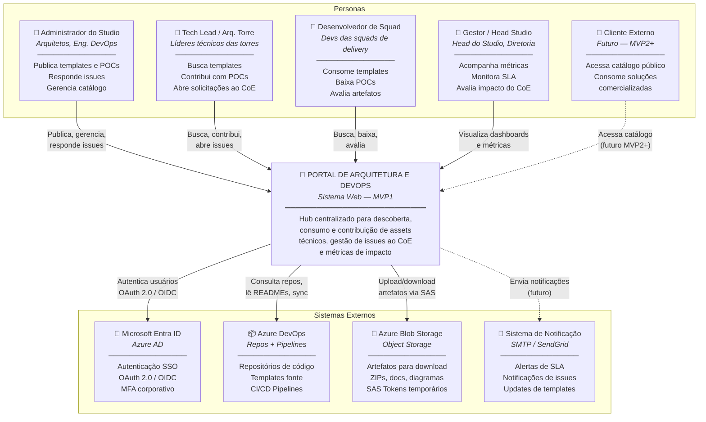
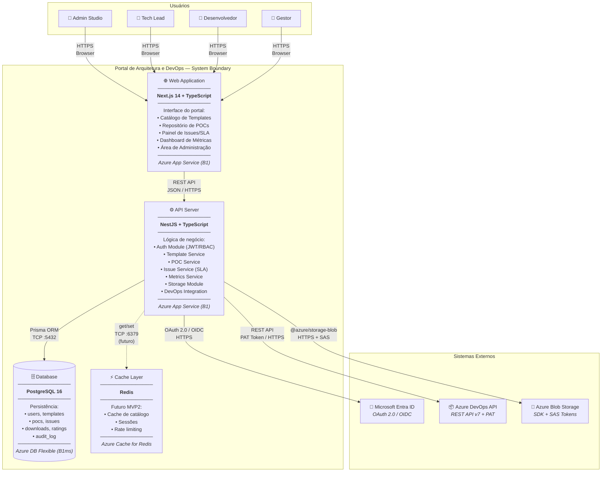
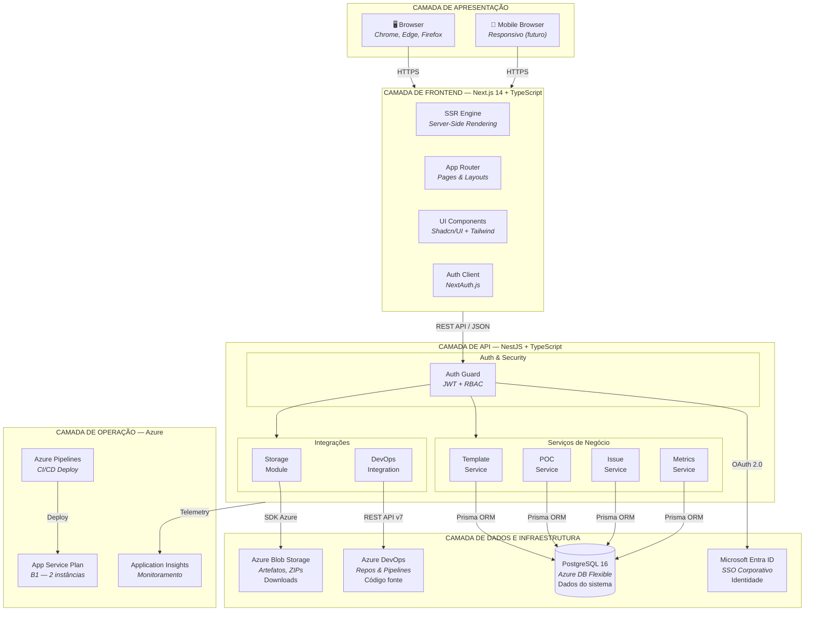

# Portal de Arquitetura e DevOps — Diagramas C4 Model + Arquitetura Alto Nível

**Projeto:** Portal de Arquitetura e DevOps — MVP1
**Data:** 26/05/2026
**Autor:** Winston (Agente Arquiteto) — Studio Foursys
**Versão:** 1.0

---

## 1. C4 Model — Nível 1: Diagrama de Contexto

> Mostra quem interage com o sistema e com quais sistemas externos ele se comunica.
> Responde: *"Qual é o panorama geral?"*

### Legenda N1

| Cor/Estilo | Significado |
|---|---|
| Linha sólida (→) | Interação ativa no MVP1 |
| Linha tracejada (- - →) | Planejado para versões futuras |
| Personas (topo) | Quem usa o sistema |
| Sistema central | O que estamos construindo |
| Sistemas externos (base) | Com o que nos integramos |

---

## 2. C4 Model — Nível 2: Diagrama de Container

> Abre o sistema e mostra as peças técnicas internas: aplicações, bancos, serviços.
> Responde: *"Quais são os blocos de construção e como se conectam?"*

### Detalhamento dos Containers

| Container | Tecnologia | Hospedagem | Responsabilidade |
|---|---|---|---|
| **Web Application** | Next.js 14, React 18, TypeScript | Azure App Service B1 | SSR, UI, formulários, navegação |
| **API Server** | NestJS, Node.js 20 LTS, TypeScript | Azure App Service B1 | Regras de negócio, auth, integrações |
| **Database** | PostgreSQL 16, Prisma ORM | Azure DB Flexible B1ms | Persistência de dados, full-text search |
| **Cache** (futuro) | Redis | Azure Cache for Redis | Cache, sessões, rate limit |

### Comunicação entre Containers

| De | Para | Protocolo | Autenticação |
|---|---|---|---|
| Browser | Web App | HTTPS (443) | Cookie/Session |
| Web App | API Server | REST/JSON (HTTPS) | JWT Bearer Token |
| API Server | PostgreSQL | TCP (5432) | Connection string + SSL |
| API Server | Azure AD | HTTPS (OAuth 2.0) | Client ID + Secret |
| API Server | Azure DevOps | HTTPS (REST) | PAT (Personal Access Token) |
| API Server | Blob Storage | HTTPS (SDK) | Storage Account Key + SAS |

---

## 3. Arquitetura de Alto Nível — MVP1

> Visão em camadas da solução completa, mostrando tecnologias, protocolos e o fluxo vertical.
> Responde: *"Como tudo se encaixa de ponta a ponta?"*

### Resumo de Tecnologias por Camada

| Camada | Tecnologias | Propósito |
|---|---|---|
| **Apresentação** | Browser moderno (Chrome, Edge) | Acesso do usuário |
| **Frontend** | Next.js 14, React 18, TypeScript, Tailwind, Shadcn/UI, NextAuth.js | Interface, SSR, autenticação client-side |
| **API** | NestJS, Node.js 20, TypeScript, Prisma, JWT, RBAC | Lógica de negócio, autorização, integrações |
| **Dados** | PostgreSQL 16, Azure Blob Storage | Persistência relacional + artefatos binários |
| **Identidade** | Microsoft Entra ID (Azure AD), OAuth 2.0, OIDC | SSO corporativo, MFA |
| **Integração** | Azure DevOps REST API v7 | Repositórios fonte, sincronização |
| **Operação** | App Service B1, Application Insights, Azure Pipelines | Hosting, monitoramento, CI/CD |

---

*Estes diagramas estão disponíveis também no formato Draw.io (.drawio) para edição visual no arquivo `diagramas-c4-mvp1.drawio`.*
