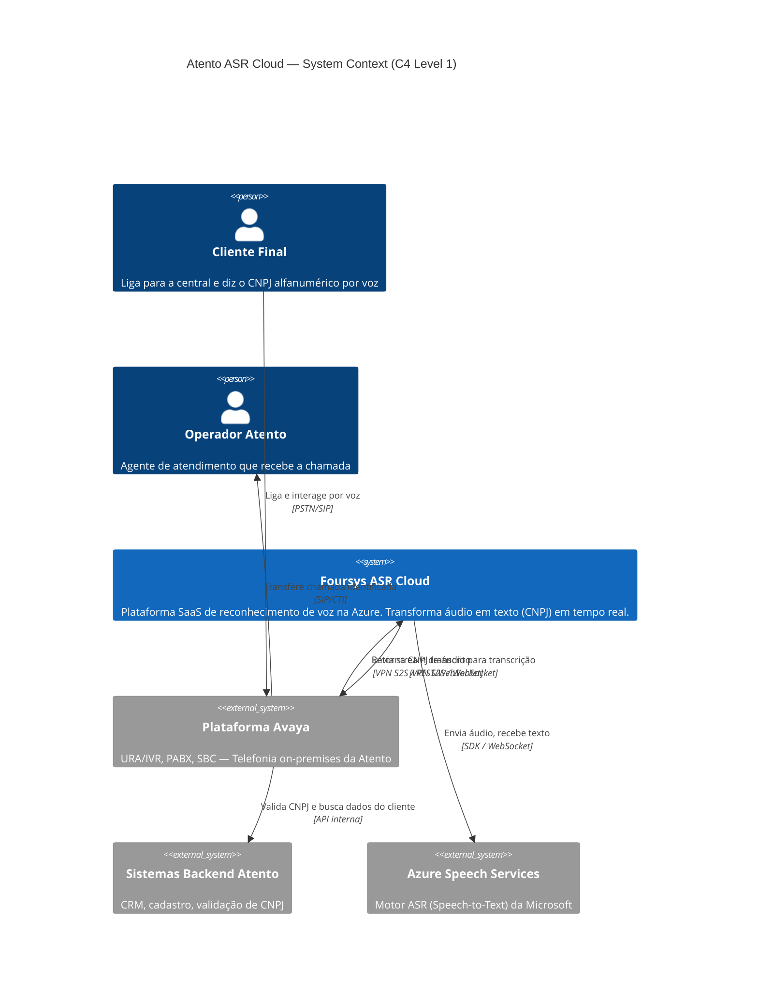
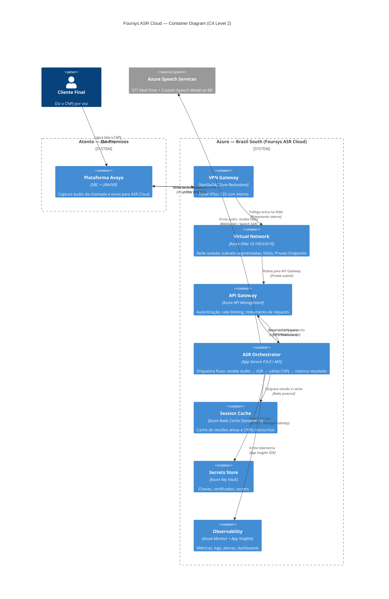
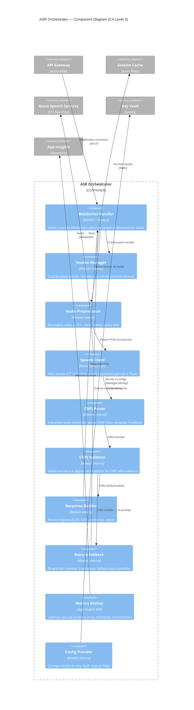
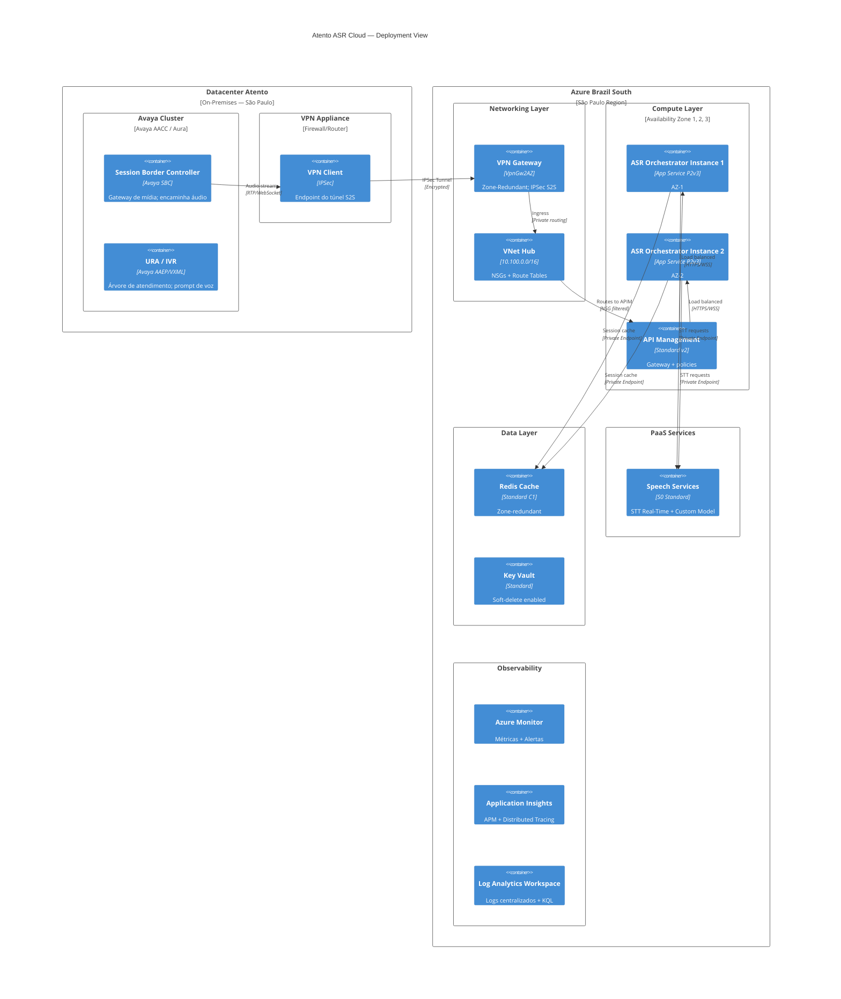
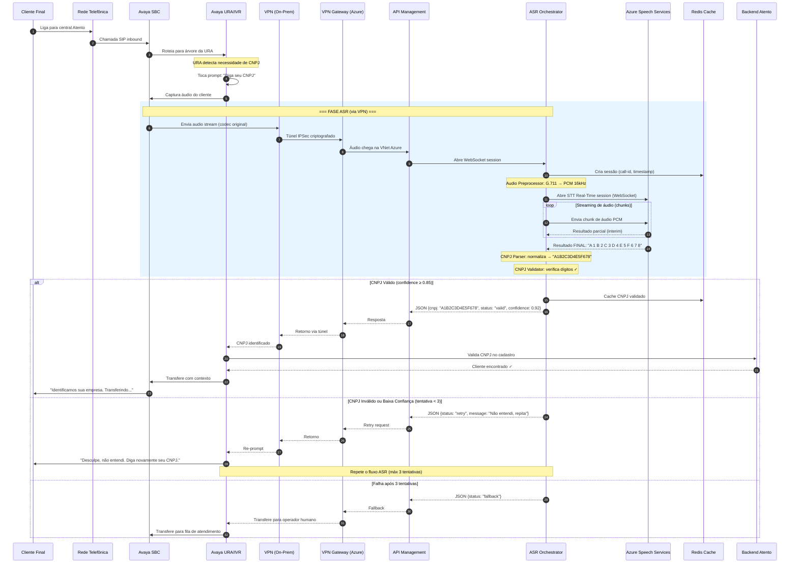

# Atento — ASR Cloud Solution: Modelo C4 & Desenho de Solução

> **Arquiteta**: Lyra — Multicloud Solution Architect  
> **Cliente**: Atento  
> **Projeto**: Reconhecimento de Voz (ASR) para CNPJ Alfanumérico  
> **Cloud**: Microsoft Azure (Brazil South)  
> **Data**: Abril 2026  
> **Status**: Proposta Técnica Aprovada — Aguardando Detalhamento

---

## Sumário Executivo

A partir de Julho/2026 o formato do CNPJ brasileiro passará a ser alfanumérico (letras + números). As URAs (IVR) da Atento, baseadas em plataforma Avaya, aceitam apenas entrada DTMF (teclado numérico), impossibilitando que novos clientes se identifiquem por telefone.

A solução proposta pela Foursys adiciona uma **camada de reconhecimento de voz (ASR) na nuvem Azure**, conectada via VPN Site-to-Site ao ambiente Avaya da Atento, permitindo que o chamador **diga o CNPJ** em vez de digitá-lo. A infraestrutura é entregue como **SaaS gerenciado pela Foursys**, com alta disponibilidade, escalabilidade automática e latência mínima.

### Decisões Arquiteturais Chave (ADRs)

| ID | Decisão | Justificativa |
|----|---------|---------------|
| ADR-001 | Azure Brazil South como região primária | Menor latência para datacenters Atento em SP (~2-5ms) |
| ADR-002 | VPN S2S com VPN Gateway Zone-Redundant | Requisito do cliente; HA nativa com 3 AZs; custo aceitável vs ExpressRoute |
| ADR-003 | Azure Speech Services (STT Real-Time) | PaaS gerenciado, pt-BR nativo, suporte a Custom Speech Model |
| ADR-004 | Custom Speech Model para CNPJ alfanumérico | Padrão novo — modelo genérico não terá acurácia suficiente para letras ditadas |
| ADR-005 | App Service com autoscale (início) → AKS (escala) | Simplicidade operacional na fase 1; migração para AKS quando > 500 chamadas/min |
| ADR-006 | Private Endpoints para todos os serviços PaaS | Zero exposição à internet pública; compliance LGPD |
| ADR-007 | WebSocket como protocolo de streaming de áudio | Latência mínima, bidirecional, suportado nativamente pelo Azure Speech SDK |

---

## 1. C4 Model — Level 1: System Context

### Descrição

Visão de mais alto nível. Mostra o sistema ASR Cloud da Foursys e como ele se relaciona com os atores externos e sistemas existentes.

### Atores e Sistemas

| Elemento | Tipo | Descrição |
|----------|------|-----------|
| **Cliente Final** | Pessoa | Liga para a central de atendimento e diz o CNPJ por voz |
| **Operador Atento** | Pessoa | Agente de atendimento que recebe a chamada após identificação |
| **Plataforma Avaya (Atento)** | Sistema Externo | URA/IVR + PABX + SBC — infraestrutura de telefonia on-premises |
| **Foursys ASR Cloud** | Sistema Principal | Plataforma SaaS de reconhecimento de voz hospedada na Azure |
| **Azure Speech Services** | Sistema Externo (PaaS) | Motor ASR da Microsoft usado internamente pelo sistema |
| **Sistemas de Backend Atento** | Sistema Externo | CRM, cadastro de clientes, validação de CNPJ |

### Diagrama — System Context (C4-L1)



### Narrativa

1. O **Cliente Final** liga para a central da Atento via rede telefônica (PSTN/SIP)
2. A **Plataforma Avaya** atende e a URA solicita: *"Por favor, diga seu CNPJ"*
3. O áudio capturado é enviado via **VPN Site-to-Site** para o **Foursys ASR Cloud**
4. O ASR Cloud processa o áudio usando o **Azure Speech Services** e retorna o texto do CNPJ
5. A Avaya valida o CNPJ com os **Sistemas Backend** e prossegue com o atendimento
6. A chamada é direcionada ao **Operador** com o contexto do cliente já identificado

---

## 2. C4 Model — Level 2: Container Diagram

### Descrição

Decomposição do sistema "Foursys ASR Cloud" em seus containers (aplicações, serviços, datastores).

### Containers

| Container | Tecnologia | Responsabilidade |
|-----------|-----------|-----------------|
| **API Gateway** | Azure API Management | Ponto de entrada; autenticação, rate limiting, roteamento |
| **ASR Orchestrator** | Azure App Service (Linux) / AKS | Middleware principal — gerencia sessões, orquestra fluxo ASR, validação de CNPJ |
| **Speech Proxy** | Módulo interno do Orchestrator | Abstração do Azure Speech SDK; gerencia WebSocket com Speech Services |
| **CNPJ Validator** | Módulo interno do Orchestrator | Validação algorítmica do CNPJ alfanumérico (dígitos verificadores) |
| **Session Cache** | Azure Redis Cache | Cache de sessões ativas, CNPJs recentes, resultados parciais |
| **Config & Secrets** | Azure Key Vault | Chaves de API, certificados VPN, configurações sensíveis |
| **Telemetry Store** | Azure Monitor + App Insights + Log Analytics | Métricas, logs, traces, dashboards operacionais |
| **VPN Tunnel** | Azure VPN Gateway (VpnGw2AZ) | Conectividade segura com datacenter Atento |
| **Virtual Network** | Azure VNet (Hub) | Rede isolada com subnets, NSGs, Private Endpoints |

### Diagrama — Container (C4-L2)



---

## 3. C4 Model — Level 3: Component Diagram (ASR Orchestrator)

### Descrição

Decomposição interna do container **ASR Orchestrator**, que é o coração da solução.

### Componentes

| Componente | Responsabilidade |
|-----------|-----------------|
| **WebSocket Handler** | Aceita conexão WebSocket da Avaya (via APIM); gerencia o stream bidirecional de áudio |
| **Session Manager** | Cria/recupera sessão da chamada; controla timeout; correlaciona com call-id Avaya |
| **Audio Preprocessor** | Normaliza formato de áudio (codec G.711 → PCM 16kHz); aplica VAD (Voice Activity Detection) |
| **Speech Client** | Wrapper do Azure Speech SDK; abre sessão STT real-time; recebe resultados parciais e finais |
| **CNPJ Parser** | Interpreta o texto transcrito; extrai o CNPJ; trata variações de fala ("A de alfa", "B de bravo") |
| **CNPJ Validator** | Valida estrutura e dígitos verificadores do CNPJ alfanumérico |
| **Response Builder** | Monta resposta estruturada (JSON) com CNPJ validado, confiança do ASR, e status |
| **Retry & Fallback Handler** | Gerencia re-prompt ("Não entendi, pode repetir?"); máximo de 3 tentativas |
| **Metrics Emitter** | Emite métricas de latência, taxa de sucesso, erros, para App Insights |
| **Config Provider** | Carrega configurações do Key Vault; gerencia feature flags |

### Diagrama — Component (C4-L3)



---

## 4. C4 Model — Deployment View

### Descrição

Mapeamento de containers para infraestrutura real Azure e on-premises.

### Diagrama — Deployment View



### Zonas de Disponibilidade

| Componente | AZ Strategy |
|-----------|-------------|
| VPN Gateway VpnGw2AZ | Zone-Redundant (AZ 1, 2, 3) |
| App Service / AKS | Min 2 instâncias em AZs distintas |
| Redis Cache | Zone-Redundant replication |
| Speech Services | Regional PaaS (HA gerenciado pela Microsoft) |
| Key Vault | Zone-Redundant (nativo) |

---

## 5. C4 Model — Dynamic View (Fluxo de uma Chamada)

### Descrição

Sequência temporal de uma chamada desde o cliente ligar até o CNPJ ser identificado.

### Diagrama — Dynamic View (Sequência)



### Tempos Esperados (Latência E2E)

| Etapa | Latência Esperada |
|-------|-------------------|
| VPN On-Prem → VPN Azure (SP ↔ SP) | 2-5 ms |
| APIM → Orchestrator | < 5 ms |
| Audio preprocessing | < 10 ms |
| Azure Speech STT (streaming result) | 200-400 ms (parcial) / 500-800 ms (final) |
| CNPJ Parse + Validate | < 5 ms |
| Response return (Azure → Atento) | 2-5 ms |
| **Total E2E** | **~300-900 ms** |

---

## 6. Desenho de Solução

### 6.1 Visão Geral da Solução

```
┌─────────────────────────────────────────────────────────────────────────────────────┐
│                                                                                     │
│                        DESENHO DE SOLUÇÃO — ATENTO ASR CLOUD                        │
│                                Foursys — SaaS Gerenciado                            │
│                                                                                     │
├─────────────────────────────────────────────────────────────────────────────────────┤
│                                                                                     │
│  ┌─────────────────────────────────────────────────────────────────────────────┐    │
│  │                    CAMADA DE CONECTIVIDADE                                  │    │
│  │                                                                             │    │
│  │   ┌──────────────────┐     IPSec S2S      ┌──────────────────────┐         │    │
│  │   │  Atento DC (SP)  │◄══════════════════►│  Azure VPN Gateway   │         │    │
│  │   │  VPN Appliance   │   AES-256 / IKEv2  │  VpnGw2AZ (3 AZs)   │         │    │
│  │   │  Avaya SBC       │                    │  10.100.0.0/16        │         │    │
│  │   └──────────────────┘                    └──────────┬───────────┘         │    │
│  │                                                       │                     │    │
│  └───────────────────────────────────────────────────────┼─────────────────────┘    │
│                                                           │                         │
│  ┌───────────────────────────────────────────────────────┼─────────────────────┐    │
│  │                    CAMADA DE SEGURANÇA                 │                     │    │
│  │                                                        │                     │    │
│  │   ┌────────────────┐   ┌─────────────┐   ┌───────────▼──────────┐          │    │
│  │   │   Azure WAF    │   │  Key Vault  │   │      NSG Rules       │          │    │
│  │   │  (se expor API │   │  Secrets    │   │  Allow: Atento IPs   │          │    │
│  │   │   futuramente) │   │  Certs      │   │  Deny: all other     │          │    │
│  │   └────────────────┘   └─────────────┘   └───────────┬──────────┘          │    │
│  │                                                       │                     │    │
│  │   ┌──────────────────────────────────────────────────────────────────┐      │    │
│  │   │  Private Endpoints: Speech, Redis, Key Vault, APIM (internal)   │      │    │
│  │   └──────────────────────────────────────────────────────────────────┘      │    │
│  │                                                                             │    │
│  └───────────────────────────────────────────────────────┼─────────────────────┘    │
│                                                           │                         │
│  ┌───────────────────────────────────────────────────────┼─────────────────────┐    │
│  │                    CAMADA DE APLICAÇÃO                 │                     │    │
│  │                                                        │                     │    │
│  │   ┌───────────────────┐      ┌────────────▼──────────────────────┐          │    │
│  │   │  API Management   │◄────►│       ASR Orchestrator            │          │    │
│  │   │  - Auth (API Key  │      │  ┌──────────────────────────┐    │          │    │
│  │   │    + Managed ID)  │      │  │  WebSocket Handler       │    │          │    │
│  │   │  - Rate Limiting  │      │  │  Session Manager         │    │          │    │
│  │   │  - Routing        │      │  │  Audio Preprocessor      │    │          │    │
│  │   │  - Request Log    │      │  │  Speech Client (SDK)     │    │          │    │
│  │   └───────────────────┘      │  │  CNPJ Parser             │    │          │    │
│  │                              │  │  CNPJ Validator           │    │          │    │
│  │                              │  │  Retry & Fallback Handler │    │          │    │
│  │                              │  │  Response Builder         │    │          │    │
│  │                              │  └──────────────────────────┘    │          │    │
│  │                              │                                   │          │    │
│  │                              │  App Service P2v3 (Fase 1)       │          │    │
│  │                              │  AKS (Fase 2 — escala > 500/min) │          │    │
│  │                              │  Autoscale: min=2, max=20        │          │    │
│  │                              └───────────────────────────────────┘          │    │
│  │                                                                             │    │
│  └─────────────────────────────────────────────────────────────────────────────┘    │
│                                                                                     │
│  ┌─────────────────────────────────────────────────────────────────────────────┐    │
│  │                    CAMADA DE INTELIGÊNCIA (ASR)                              │    │
│  │                                                                             │    │
│  │   ┌───────────────────────────────────────────────────────────────────┐     │    │
│  │   │              Azure Speech Services (S0 Standard)                  │     │    │
│  │   │                                                                   │     │    │
│  │   │   ┌─────────────────────┐    ┌──────────────────────────────┐   │     │    │
│  │   │   │  Speech-to-Text     │    │  Custom Speech Model         │   │     │    │
│  │   │   │  Real-Time          │    │  - Treinado com CNPJs        │   │     │    │
│  │   │   │  Streaming API      │    │    alfanuméricos             │   │     │    │
│  │   │   │  pt-BR              │    │  - Sotaques regionais        │   │     │    │
│  │   │   │                     │    │  - Alfabeto fonético         │   │     │    │
│  │   │   │                     │    │    ("A de alfa", "B bravo")  │   │     │    │
│  │   │   └─────────────────────┘    └──────────────────────────────┘   │     │    │
│  │   │                                                                   │     │    │
│  │   └───────────────────────────────────────────────────────────────────┘     │    │
│  │                                                                             │    │
│  └─────────────────────────────────────────────────────────────────────────────┘    │
│                                                                                     │
│  ┌─────────────────────────────────────────────────────────────────────────────┐    │
│  │                    CAMADA DE DADOS                                           │    │
│  │                                                                             │    │
│  │   ┌──────────────────┐    ┌──────────────────┐                              │    │
│  │   │  Azure Redis     │    │  Azure SQL / CosmosDB (futuro)                  │    │
│  │   │  Cache           │    │  - Histórico de transcrições                    │    │
│  │   │  - Sessões       │    │  - Auditoria LGPD                              │    │
│  │   │  - Cache CNPJ    │    │  - Analytics                                   │    │
│  │   │  - Rate state    │    │                                                │    │
│  │   └──────────────────┘    └──────────────────┘                              │    │
│  │                                                                             │    │
│  └─────────────────────────────────────────────────────────────────────────────┘    │
│                                                                                     │
│  ┌─────────────────────────────────────────────────────────────────────────────┐    │
│  │                    CAMADA DE OBSERVABILIDADE                                 │    │
│  │                                                                             │    │
│  │   ┌──────────────┐  ┌───────────────┐  ┌──────────────┐  ┌─────────────┐  │    │
│  │   │ Azure Monitor│  │ App Insights  │  │Log Analytics │  │  Alertas    │  │    │
│  │   │ Métricas     │  │ APM + Traces  │  │ KQL Queries  │  │  PagerDuty  │  │    │
│  │   │ Dashboards   │  │ Live Metrics  │  │ Retention    │  │  Email/SMS  │  │    │
│  │   └──────────────┘  └───────────────┘  └──────────────┘  └─────────────┘  │    │
│  │                                                                             │    │
│  │   KPIs Monitorados:                                                         │    │
│  │   • Latência E2E (p50, p95, p99)      • Chamadas concorrentes              │    │
│  │   • Taxa de reconhecimento ASR (%)     • Erros por tipo                     │    │
│  │   • Taxa de retry / fallback           • Utilização CPU/Memória             │    │
│  │   • Throughput (chamadas/min)          • Saúde do túnel VPN                 │    │
│  │                                                                             │    │
│  └─────────────────────────────────────────────────────────────────────────────┘    │
│                                                                                     │
└─────────────────────────────────────────────────────────────────────────────────────┘
```

### 6.2 Topologia de Rede Detalhada

```
┌──────────────────────────────────────────────────────────────────────────────────┐
│                         TOPOLOGIA DE REDE                                        │
│                                                                                  │
│  ATENTO (On-Prem)                    │          AZURE (Brazil South)             │
│                                      │                                           │
│  ┌─────────────┐                     │     ┌──────────────────────────────────┐  │
│  │ Avaya SBC   │                     │     │  VNet: 10.100.0.0/16            │  │
│  │ 10.0.1.x    │                     │     │                                  │  │
│  └──────┬──────┘                     │     │  ┌────────────────────────────┐  │  │
│         │                            │     │  │ GatewaySubnet             │  │  │
│  ┌──────▼──────┐    ┌─────────┐      │     │  │ 10.100.0.0/27             │  │  │
│  │  Firewall / │    │  IPSec  │      │     │  │                            │  │  │
│  │  Router     ├────┤  Tunnel ├──────┼─────┤  │  ┌─────────────────────┐  │  │  │
│  │  10.0.0.1   │    │  IKEv2  │      │     │  │  │ VPN GW VpnGw2AZ    │  │  │  │
│  └─────────────┘    │  AES256 │      │     │  │  │ Active-Active      │  │  │  │
│                     └─────────┘      │     │  │  │ BGP Enabled        │  │  │  │
│                                      │     │  │  └─────────────────────┘  │  │  │
│  UDR: 10.100.0.0/16                 │     │  └────────────────────────────┘  │  │
│  → via VPN Tunnel                    │     │                                  │  │
│                                      │     │  ┌────────────────────────────┐  │  │
│                                      │     │  │ Subnet-APIM               │  │  │
│                                      │     │  │ 10.100.1.0/24             │  │  │
│                                      │     │  │ NSG: Allow 10.0.0.0/8     │  │  │
│                                      │     │  │      Deny *               │  │  │
│                                      │     │  └────────────────────────────┘  │  │
│                                      │     │                                  │  │
│                                      │     │  ┌────────────────────────────┐  │  │
│                                      │     │  │ Subnet-App                │  │  │
│                                      │     │  │ 10.100.2.0/24             │  │  │
│                                      │     │  │ App Service VNet Integr.  │  │  │
│                                      │     │  │ NSG: Allow from APIM only │  │  │
│                                      │     │  └────────────────────────────┘  │  │
│                                      │     │                                  │  │
│                                      │     │  ┌────────────────────────────┐  │  │
│                                      │     │  │ Subnet-PrivateEndpoints   │  │  │
│                                      │     │  │ 10.100.3.0/24             │  │  │
│                                      │     │  │ PE: Speech, Redis, KV     │  │  │
│                                      │     │  └────────────────────────────┘  │  │
│                                      │     │                                  │  │
│                                      │     └──────────────────────────────────┘  │
│                                      │                                           │
└──────────────────────────────────────┴───────────────────────────────────────────┘
```

### 6.3 Estratégia de Escalabilidade

```
                    ESCALABILIDADE AUTOMÁTICA
    ┌──────────────────────────────────────────────────┐
    │                                                  │
    │   Fase 1 (MVP): 1-10 chamadas/min               │
    │   ┌──────────────────────────────────────┐       │
    │   │  App Service Plan P2v3               │       │
    │   │  • 2 instâncias (min)                │       │
    │   │  • Autoscale: CPU > 70% → +1         │       │
    │   │  • Max: 5 instâncias                 │       │
    │   │  • ~20 sessões concorrentes          │       │
    │   └──────────────────────────────────────┘       │
    │                          │                        │
    │                          ▼ Trigger: > 500/min     │
    │                                                  │
    │   Fase 2 (Escala): 100-1000 chamadas/min         │
    │   ┌──────────────────────────────────────┐       │
    │   │  Azure Kubernetes Service (AKS)      │       │
    │   │  • Node pool: Standard_D4s_v3        │       │
    │   │  • HPA: CPU > 60% → scale pods       │       │
    │   │  • Cluster Autoscaler: 3-20 nodes    │       │
    │   │  • ~166 sessões concorrentes (pico)  │       │
    │   │  • KEDA para scale-to-zero off-peak  │       │
    │   └──────────────────────────────────────┘       │
    │                                                  │
    │   Speech Services: PaaS auto-scale (sem config)  │
    │   Redis: Scale up de C1 → C2/C3 conforme sessões │
    │   VPN: VpnGw2 suporta até 1.25 Gbps (suficiente)│
    │                                                  │
    └──────────────────────────────────────────────────┘
```

### 6.4 Alta Disponibilidade e Disaster Recovery

```
┌──────────────────────────────────────────────────────────────────────┐
│                    ESTRATÉGIA DE HA / DR                              │
│                                                                      │
│  ┌────────────────────────────────────────────────────────────────┐  │
│  │  CENÁRIO 1: Falha de Instância (HA — Automático)              │  │
│  │                                                                │  │
│  │  • App Service: 2+ instâncias em AZs distintas                │  │
│  │  • VPN Gateway: Zone-Redundant (3 AZs)                        │  │
│  │  • Redis: Zone-Redundant replication                          │  │
│  │  • Failover: Automático, transparente, < 30s                  │  │
│  │  • SLA resultante: 99.95%                                     │  │
│  └────────────────────────────────────────────────────────────────┘  │
│                                                                      │
│  ┌────────────────────────────────────────────────────────────────┐  │
│  │  CENÁRIO 2: Falha de Zona (HA — Automático)                   │  │
│  │                                                                │  │
│  │  • Todos os componentes são Zone-Redundant                    │  │
│  │  • Perda de 1 AZ não afeta operação                           │  │
│  │  • Capacidade reduzida temporariamente → autoscale compensa   │  │
│  │  • SLA resultante: 99.95%                                     │  │
│  └────────────────────────────────────────────────────────────────┘  │
│                                                                      │
│  ┌────────────────────────────────────────────────────────────────┐  │
│  │  CENÁRIO 3: Falha Regional (DR — Manual/Semi-Auto)            │  │
│  │                                                                │  │
│  │  Região secundária: Brazil Southeast ou East US                │  │
│  │  • Standby frio (cold): infra provisionada mas desligada     │  │
│  │  • RTO: 30-60 minutos                                         │  │
│  │  • RPO: 0 (stateless — sem dados persistidos no ASR)          │  │
│  │  • VPN secundário pré-configurado (standby)                   │  │
│  │  • Custo adicional mínimo (só paga quando ativa)              │  │
│  │  • Recomendação: implementar apenas se SLA > 99.99% exigido   │  │
│  └────────────────────────────────────────────────────────────────┘  │
│                                                                      │
│  ┌────────────────────────────────────────────────────────────────┐  │
│  │  CENÁRIO 4: Falha do Túnel VPN                                │  │
│  │                                                                │  │
│  │  • VPN Gateway Active-Active: 2 túneis simultâneos            │  │
│  │  • Atento configura 2 peers no firewall/router                │  │
│  │  • Se túnel 1 cai, tráfego redireciona para túnel 2           │  │
│  │  • Failover: < 15 segundos (BGP convergence)                  │  │
│  │  • Monitoramento: Azure Network Watcher Connection Monitor    │  │
│  └────────────────────────────────────────────────────────────────┘  │
│                                                                      │
└──────────────────────────────────────────────────────────────────────┘
```

### 6.5 Segurança e Compliance

| Camada | Controle | Detalhe |
|--------|---------|---------|
| **Rede** | VPN S2S IPSec | IKEv2, AES-256-GCM, PFS (Perfect Forward Secrecy) |
| **Rede** | NSG (Network Security Groups) | Whitelist apenas IPs Atento; deny all inbound |
| **Rede** | Private Endpoints | Speech, Redis, Key Vault — sem exposição pública |
| **Identidade** | Managed Identity | App Service acessa recursos sem credenciais no código |
| **Identidade** | API Keys + APIM | Autenticação por subscription key para o endpoint ASR |
| **Dados** | Encryption at rest | AES-256 (padrão Azure) para Redis, Key Vault, Logs |
| **Dados** | Encryption in transit | TLS 1.2+ em todas as comunicações internas |
| **Dados** | Retenção de áudio | **Nenhuma** — áudio descartado após transcrição (LGPD) |
| **Dados** | Logs de auditoria | Log Analytics com retenção de 90 dias (configurável) |
| **Compliance** | LGPD | Dados em Brazil South; sem transferência internacional |
| **Compliance** | Azure | SOC 1/2/3, ISO 27001, PCI DSS (infra Azure) |

### 6.6 Roadmap de Evolução (Futuro)

```
    2026 H2                    2027 H1                    2027 H2
    ┌──────────────┐           ┌──────────────┐           ┌──────────────┐
    │  FASE 1      │           │  FASE 2      │           │  FASE 3      │
    │  ASR Voice   │           │  Escala +     │           │  Omnichannel │
    │  para URA    │           │  Migração AKS │           │              │
    │              │           │              │           │              │
    │ • VPN S2S    │    ──►    │ • AKS         │    ──►    │ • WhatsApp   │
    │ • Speech STT │           │ • Custom Model│           │ • Chatbot    │
    │ • Middleware │           │   refinado    │           │ • Web Widget │
    │ • 1-50/min  │           │ • 50-1000/min │           │ • NLU/Intent │
    │ • SaaS MVP  │           │ • Analytics   │           │ • Full SaaS  │
    │              │           │ • Dashboard   │           │   Platform   │
    └──────────────┘           └──────────────┘           └──────────────┘
```

---

## 7. Estimativa de Recursos Azure (BoM — Bill of Materials)

### Cenário Fase 1 (MVP — até 50 chamadas/min)

| Recurso Azure | SKU | Qtd | Estimativa Mensal (BRL)* |
|--------------|-----|-----|--------------------------|
| VPN Gateway | VpnGw2AZ | 1 | ~R$ 2.800 |
| App Service Plan | P2v3 (Linux) | 1 (2 instâncias) | ~R$ 1.400 |
| API Management | Standard v2 | 1 | ~R$ 1.800 |
| Azure Speech Services | S0 (STT Real-Time) | Pay-per-use | ~R$ 500-2.000** |
| Custom Speech Model | Hosting | 1 endpoint | ~R$ 700 |
| Redis Cache | Standard C1 | 1 | ~R$ 400 |
| Key Vault | Standard | 1 | ~R$ 20 |
| Azure Monitor + App Insights | Pay-per-use | 1 workspace | ~R$ 300-500 |
| VNet + NSG + Private Endpoints | - | - | ~R$ 200 |
| **TOTAL ESTIMADO (Fase 1)** | | | **~R$ 8.100 - 9.900/mês** |

> \* Valores aproximados em Abril/2026. Confirmar com Azure Pricing Calculator.  
> \*\* Speech STT: ~R$ 5,20 por hora de áudio processado. Para 50 chamadas/min × 10s × 8h/dia × 22 dias ≈ 73h/mês ≈ R$ 380. Para pico de 1.000/min, escala proporcionalmente.

---

## 8. Riscos e Mitigações

| # | Risco | Impacto | Probabilidade | Mitigação |
|---|-------|---------|---------------|-----------|
| R1 | Acurácia do ASR para CNPJ alfanumérico insuficiente | Alto | Média | Custom Speech Model + CNPJ Parser com heurísticas fonéticas |
| R2 | Latência VPN acima do aceitável | Alto | Baixa | Monitoramento proativo; upgrade para ExpressRoute se necessário |
| R3 | Integração Avaya complexa (versão antiga) | Médio | Média | PoC de integração antes do go-live; middleware adaptável |
| R4 | Escala de 10→1000/min não suave | Médio | Baixa | Autoscale + load testing pré-produção + AKS na Fase 2 |
| R5 | Compliance LGPD: auditoria questiona fluxo de áudio | Médio | Média | Documentar que áudio é transiente; não persiste pós-transcrição |
| R6 | Custo Azure superior ao budgetado | Baixo | Média | Alertas de custo + Azure Advisor + Reserved Instances |

---

## 9. Premissas e Dependências

### Premissas
- Datacenter da Atento está em São Paulo (validar)
- Avaya suporta envio de áudio via SIP/RTP ou WebSocket (validar versão)
- O formato final do CNPJ alfanumérico segue a especificação da Receita Federal
- Foursys terá acesso à Azure com subscription própria para hospedar

### Dependências
- **Atento**: fornecer detalhes da infra Avaya, IPs, e disponibilizar ambiente de teste
- **Foursys**: provisionamento da Azure subscription e setup do túnel VPN
- **Microsoft**: disponibilidade do Custom Speech Service em Brazil South (confirmar)
- **Receita Federal**: especificação final do formato CNPJ alfanumérico

---

## 10. Próximos Passos

| # | Ação | Responsável | Prazo |
|---|------|-------------|-------|
| 1 | Coletar informações técnicas da Avaya (versão, protocolos, IPs) | Vendedor + Atento | 1 semana |
| 2 | Validar Custom Speech disponibilidade em Brazil South | Arquiteto Foursys | 3 dias |
| 3 | PoC: teste de reconhecimento de CNPJ alfanumérico com Azure Speech | Arquiteto + Dev | 2 semanas |
| 4 | Sizing definitivo com Azure Pricing Calculator | Arquiteto | 1 semana |
| 5 | Proposta comercial SaaS (custo + margem + SLA) | Vendedor + Financeiro | 1 semana |
| 6 | Aprovação e kick-off do projeto | Cliente Atento | TBD |

---

> **Documento produzido por Lyra — Arquiteta Multicloud, Foursys**  
> **Revisão**: v1.0 — Abril 2026  
> **Classificação**: Confidencial — Uso Interno Foursys + Atento
